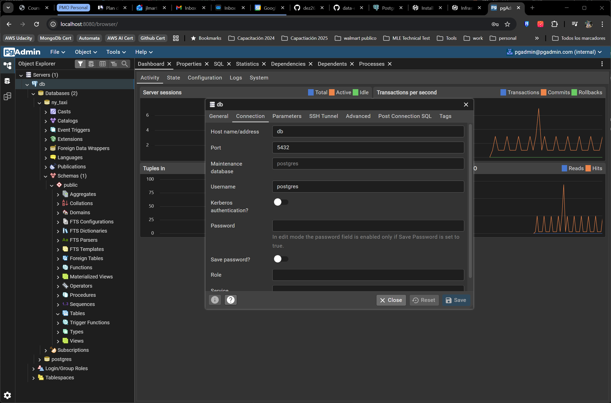

# Question 1 

- pip version on `python:3.13` image

- Answeer: 25.3

``` bash
maxkaizo@max:~/dez26$ docker run -it --rm python:3.13 pip --version
pip 25.3 from /usr/local/lib/python3.13/site-packages/pip (python 3.13)
```
---

# Question 2

- postgress host and port

- Answer: db:5432



---
# Question 3

- Counting short trips

- Answer: 8007

``` sql
postgres@localhost:ny_taxi> SELECT
     count(1)
 FROM
     green_trips
 WHERE lpep_pickup_datetime >= '2025-11-01'
   AND lpep_pickup_datetime <  '2025-12-01'
   AND trip_distance <= 1
+-------+
| count |
|-------|
| 8007  |
+-------+
SELECT 1
Time: 0.032s
postgres@localhost:ny_taxi>

```
---