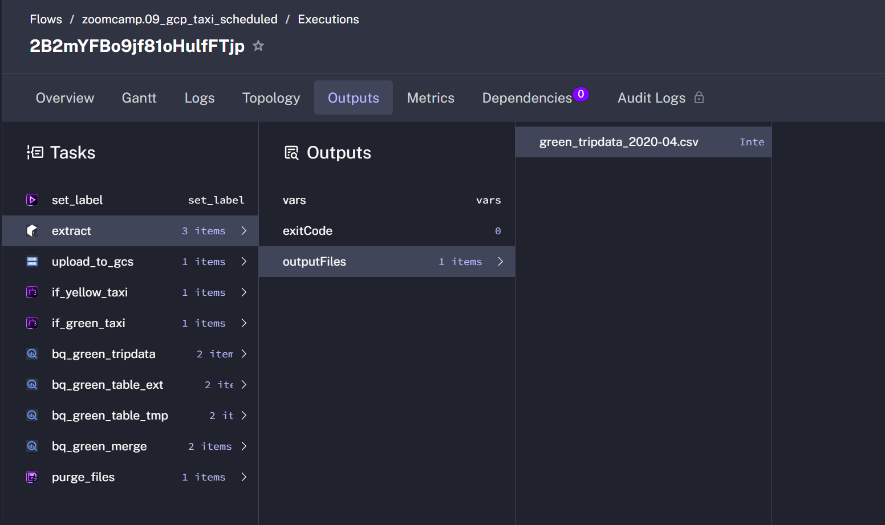

# Question 1

- Question 1. Within the execution for Yellow Taxi data for the year 2020 and month 12: what is the uncompressed file size (i.e. the output file yellow_tripdata_2020-12.csv of the extract task)?

- Answer: 128.3 MiB

```bash
maxkaizo@max:~/tmp$ ls -lash yellow_tripdata_2020-12.csv 
129M -rw-r--r-- 1 maxkaizo maxkaizo 129M Jul 14  2022 yellow_tripdata_2020-12.csv
```


# Question 2. 

- What is the rendered value of the variable file when the inputs taxi is set to green, year is set to 2020, and month is set to 04 during execution?

- Answer: green_tripdata_2020-04.csv



# Question 3

- How many rows are there for the Yellow Taxi data for all CSV files in the year 2020?

- Answer: 24648663

```bash

maxkaizo@max:~$ bq query --use_legacy_sql=false '
> SELECT COUNT(*)
FROM `dataeng-448500.dez26hw02.yellow_tripdata`
WHERE EXTRACT(YEAR FROM tpep_pickup_datetime) = 2020
> '
+----------+
|   f0_    |
+----------+
| 24648663 |
+----------+
```

# Question 4

- How many rows are there for the Green Taxi data for all CSV files in the year 2020?

- Answer: 1734039

```bash
maxkaizo@max:~$ bq query --use_legacy_sql=false '
> SELECT COUNT(*)
FROM `dataeng-448500.dez26hw02.green_tripdata`
WHERE EXTRACT(YEAR FROM lpep_pickup_datetime) = 2020
> '
+---------+
|   f0_   |
+---------+
| 1734039 |
+---------+
```

# Question 5

- How many rows are there for the Yellow Taxi data for the March 2021 CSV file?

- Answer: 1925130

```bash
maxkaizo@max:~$ bq query --use_legacy_sql=false '
> SELECT COUNT(*)
FROM `dataeng-448500.dez26hw02.yellow_tripdata`
WHERE EXTRACT(YEAR FROM tpep_pickup_datetime) = 2021
AND EXTRACT(MONTH FROM tpep_pickup_datetime) = 3
> '
+---------+
|   f0_   |
+---------+
| 1925130 |
+---------+
```

# Question 6

- How would you configure the timezone to New York in a Schedule trigger? 

- Answer: Add a timezone property set to America/New_York in the Schedule trigger configuration

According to the Kestra documentation:

---
To set up the time zone for triggers in Kestra, you can use the timezone property within the trigger definition. This property allows you to specify a time zone identifier for evaluating cron expressions.

How to set the timezone property:

Locate the Trigger Definition: In your flow's YAML, find the triggers section and the specific trigger you want to configure (e.g., io.kestra.plugin.core.trigger.Schedule or io.kestra.plugin.core.trigger.ScheduleOnDates).
Add timezone Property: Add the timezone property to the trigger, using a time zone identifier (e.g., America/New_York).
Example for a Schedule trigger:

```yaml
triggers:
  - id: daily
    type: io.kestra.plugin.core.trigger.Schedule
    cron: "@daily"
    timezone: America/New_York
```

Key Points:

Default Time Zone: Schedules default to UTC if no timezone is explicitly set.
Time Zone Identifier: Use standard time zone identifiers (like those found in the tz database, e.g., America/New_York, Europe/Paris, Asia/Tokyo).
Server and Database Alignment: It's recommended to keep your Kestra server and database time zones aligned to avoid unexpected differences.
---
