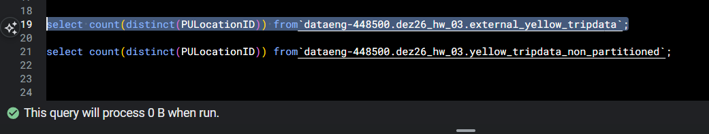
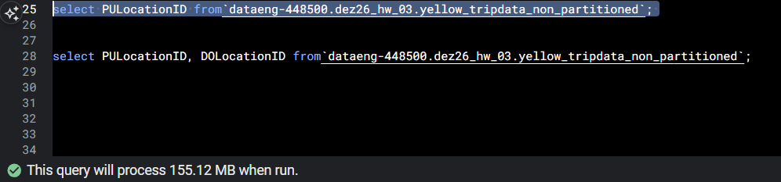
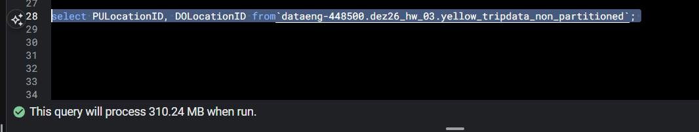
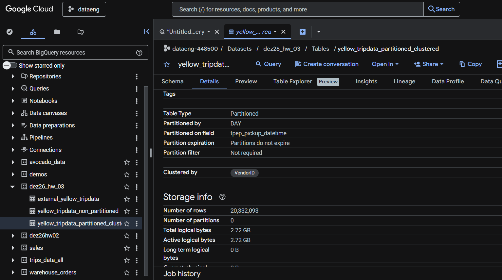
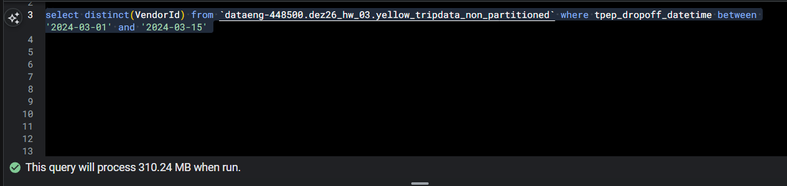
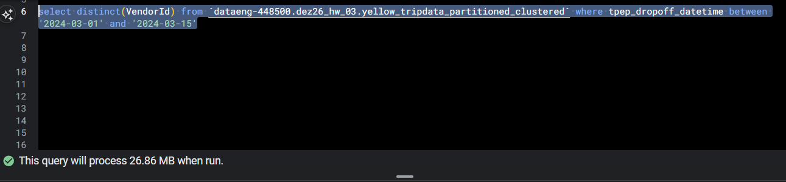

# Preparation

External table creation:


materialized table creation:


# Question 1

- What is count of records for the 2024 Yellow Taxi Data?

- Answer: 20,332,093

``` sql
maxkaizo@max:~/dez26$ bq query --use_legacy_sql=false '
select count(1) from `dataeng-448500.dez26_hw_03.external_yellow_tripdata`;
'
+----------+
|   f0_    |
+----------+
| 20332093 |
+----------+
```

# Question 2

- What is the estimated amount of data that will be read when this query is executed on the External Table and the Table?

- Answer: 0 MB for the External Table and 155.12 MB for the Materialized Table



 

 # Question 3

 - Why are the estimated number of Bytes different?

 - Answer: BigQuery is a columnar database, and it only scans the specific columns requested in the query. Querying two columns (PULocationID, DOLocationID) requires reading more data than querying one column (PULocationID), leading to a higher estimated number of bytes processed.

 

 


 # Question 4

- How many records have a fare amount of 0?

- Answer: 8,333

``` sql
 maxkaizo@max:~/dez26$ bq query --use_legacy_sql=false '
select count(1) from`dataeng-448500.dez26_hw_03.yellow_tripdata_non_partitioned` where fare_amount = 0;
'
+------+
| f0_  |
+------+
| 8333 |
+------+
```
# Question 5

- What is the best strategy to make an optimized table in Big Query if your query will always filter based on tpep_dropoff_datetime and order the results by VendorID (Create a new table with this strategy)
- Answer: Partition by tpep_dropoff_datetime and Cluster on VendorID



``` sql
CREATE OR REPLACE TABLE dataeng-448500.dez26_hw_03.yellow_tripdata_partitioned_clustered
PARTITION BY DATE(tpep_pickup_datetime)
CLUSTER BY VendorID AS
SELECT * FROM `dataeng-448500.dez26_hw_03.external_yellow_tripdata`;
```
# Question 6 

- Write a query to retrieve the distinct VendorIDs between tpep_dropoff_datetime 2024-03-01 and 2024-03-15 (inclusive). Use the materialized table you created earlier in your from clause and note the estimated bytes. Now change the table in the from clause to the partitioned table you created for question 5 and note the estimated bytes processed. What are these values?

- Answer: 310.24 MB for non-partitioned table and 26.84 MB for the partitioned table






